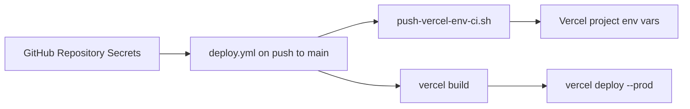

# BrandMate — GitHub CI + Vercel auto-config

Pushing to `main` automatically:

1. Syncs secrets from **GitHub Repository Secrets** → **Vercel** env vars
2. Builds and deploys to Vercel production

Workflow file: [`.github/workflows/deploy.yml`](../.github/workflows/deploy.yml)

## One-time setup

### 1. Create Vercel project

1. Import the GitHub repo at [vercel.com/new](https://vercel.com/new)
2. Or run locally: `vercel link`

### 2. Get Vercel IDs and token

```bash
vercel login
vercel link
cat .vercel/project.json   # VERCEL_ORG_ID + VERCEL_PROJECT_ID
```

Create a token: [vercel.com/account/tokens](https://vercel.com/account/tokens) → `VERCEL_TOKEN`

### 3. Add GitHub Repository Secrets

Repo → **Settings** → **Secrets and variables** → **Actions** → **New repository secret**

| Secret | Value | Required |
|--------|-------|----------|
| `VERCEL_TOKEN` | Vercel API token | Yes |
| `VERCEL_ORG_ID` | From `.vercel/project.json` → `orgId` | Yes |
| `VERCEL_PROJECT_ID` | From `.vercel/project.json` → `projectId` | Yes |
| `OPENAI_API_KEY` | OpenAI API key | Yes |
| `REDIS_URL` | Redis Cloud `rediss://...` URL (not localhost) | Yes |
| `WANDB_API_KEY` | W&B API key | Yes |
| `WEAVE_PROJECT` | e.g. `your-username/brandmate` | Yes |
| `OPENAI_MODEL` | `gpt-4o-mini` | Optional (defaults in app) |
| `OPENAI_EMBEDDING_MODEL` | `text-embedding-3-small` | Optional |

**Important:** `REDIS_URL` in GitHub must be your **Redis Cloud** URL, not `localhost`.

### 4. Push to `main`

The workflow runs on every push to `main` (after `package.json` exists).

Manual trigger: **Actions** → **Deploy BrandMate to Vercel** → **Run workflow**

## Local alternative (without CI)

```bash
cp .env.vercel.example .env.vercel
# edit .env.vercel
vercel login && vercel link
bash scripts/push-vercel-env.sh .env.vercel production
vercel --prod
```

## How CI sync works



Each deploy re-syncs env vars so updating a GitHub Secret updates Vercel on the next push.

## Troubleshooting

| Issue | Fix |
|-------|-----|
| Workflow skipped | `package.json` missing — run app scaffold first |
| `VERCEL_TOKEN` invalid | Regenerate token, update GitHub secret |
| Redis connection fails on Vercel | Ensure `REDIS_URL` secret uses `rediss://` Redis Cloud URL |
| Env var has trailing newline | CI script uses `echo -n` — do not add newlines in GitHub secret values |
